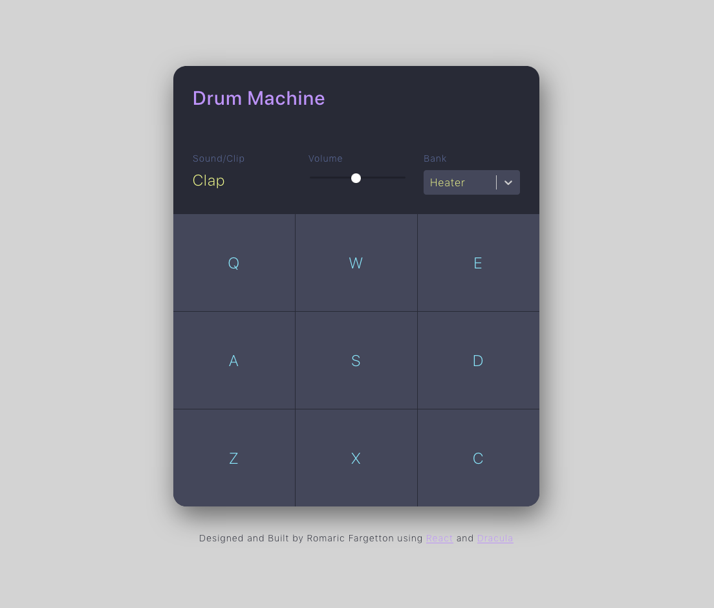

# React Drum Machine

A drum machine built with React, featuring the [Dracula color scheme](https://github.com/dracula/dracula-theme) and bootstraped with [Create React App](https://github.com/facebook/create-react-app). See a live demo [here](https://drum.romaricfargetton.com)

[](https://app.netlify.com/sites/reverent-mccarthy-b645e6/deploys)



## Features

- **Keyboard support**
- **Visual feedback**, with sound display and pad activation
- **Volume control**
- Possibility to switch between **multiple sound banks**

## Installation

1. Clone this repo
    ```
    git clone https://www.github.com/rfargetton/react-drum-machine
    ``` 
2. Install npm packages
    ```
    cd react-drum-machine && npm install
    ```
3. Run a development server
    ```
    npm start
    ```
4. Create a production build
    ```
    npm run build
    ```
